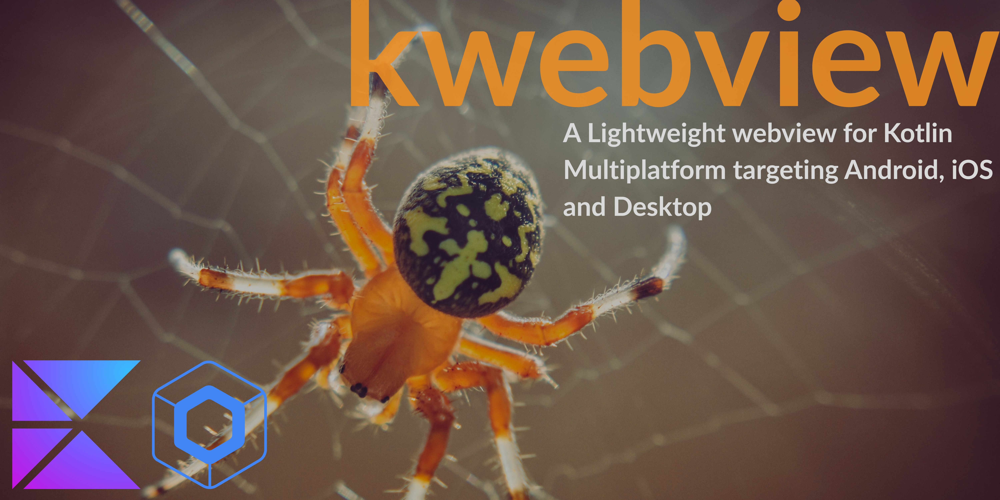

<a href="http://www.wtfpl.net/"></a>
[](https://kotlinlang.org/)
[](https://gradle.org/)



<!-- GETTING STARTED -->
## Getting Started
### Adding dependencies
- Add it in your `commonMain.dependencies`
  ```
  implementation("io.github.shadmanadman:kwebview:1.31.5")
  ```

### Usage  
```
KWebView(
    modifier: Modifier? = null,
    url: String? = null,
    htmlContent: String? = null,
    enableJavaScript: Boolean = false,
    allowCookies: Boolean = false,
    enableDomStorageForAndroid: Boolean=false,
    isLoading: ((isLoading: Boolean) -> Unit)? = null,
    onUrlClicked: ((url: String) -> Unit)? = null
)
```
- `isLoading`: Current loading status of the web view
- `onUrlClicked`: If user click's on a link inside your web view you can handel it here. 
   - *Note*: Images(jpg,pngs) and attachment.id are excluded and will be opened inside your     
     current web view.
   - *Note*: If you don't implement this, all links will be opened in your current web view.
- `enableJavaScript`: Enable javascript content
- `allowCookies`: allow the webview to use cookies
- `enableDomStorageForAndroid`: enable DOM storage for Android

#### Inject cookies
Create a list of `Cookies` and pass it to the `KWebView`:
```
val mCookies = listOf(
    Cookies(
        val name: String,
        val value: String,
        val domain: String,
        val path: String = "/",
        val expires: String? = null,
        val maxAge: Long? = null,
        val secure: Boolean = false,
        val httpOnly: Boolean = false,
        val sameSite: String? = null
    )
)
KWebView(allowCookies= true, injectCookies = mCookies, url = example.com, ...)
```

#### Rearranging html content
If you are loading html content you can change some font options and rearrange the content to be shown better
on smaller devices:
```
KWebView(
    htmlContent: content.formatHtmlContent(
    fontSize: Int = 12,
    textAlign: TextAlign = TextAlign.JUSTIFY,
    fontColor: String = "#000000"
    ),
    //... other params 
)
```
### Licence       
```
               DO WHAT THE FUCK YOU WANT TO PUBLIC LICENSE 
                    Version 2, December 2004 

 Copyright (C) 2025 Shadman Adman <adman.shadman@gmail.com> 

 Everyone is permitted to copy and distribute Kmp-WebView or modified 
 copies of this license document, and changing it is allowed as long 
 as the name is changed. 

            DO WHAT THE FUCK YOU WANT TO PUBLIC LICENSE 
   TERMS AND CONDITIONS FOR COPYING, DISTRIBUTION AND MODIFICATION 

0. You just DO WHAT THE FUCK YOU WANT TO.
```
