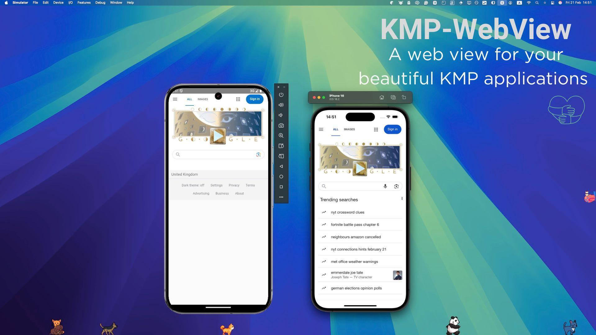

[](https://opensource.org/licenses/Apache-2.0)




<!-- GETTING STARTED -->
## Getting Started
### Adding dependencies
- Add it in your `commonMain.dependencies`
```
@Composable
fun KmpWebViewScreen(
    modifier: Modifier? = null,
    url: String? = null,
    htmlContent: String? = null,
    isLoading: ((isLoading: Boolean) -> Unit)? = null,
    onUrlClicked: ((url: String) -> Unit)? = null
)
```
- `isLoading`: Current loading status of the web view
- `onUrlClicked`: If user click's on a link inside your web view you can handel it here. 
  Note: Images(jpg,pngs) and attachment.id are excluded and will be opened inside your current web view.
  Note: If you don't implement this, all links will be opened in your current web view.

#### Any contribution is very satisfying. Make it easier for everyone